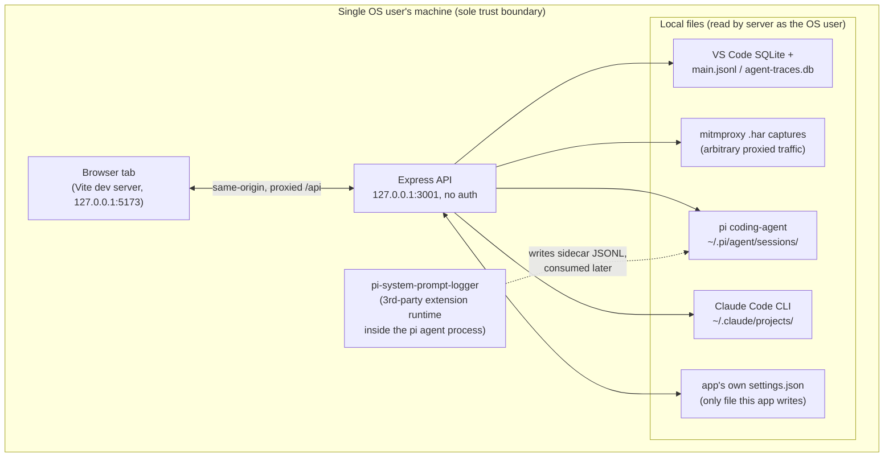

# Threat model

Reviewed against the codebase as of `e7bd2c2` (2026-09-09). Verified by
reading the actual routes, SQL access, session-ID resolution, redaction
logic, and network bindings — not assumed from the architecture docs alone.

## 1. System summary

A local-only tool: an Express API (`packages/server`) reads session logs
from disk and serves them to a React SPA (`packages/web`) via Vite's dev
proxy. There is no remote backend, no user accounts, and no network egress
initiated by the app itself — every "data source" is a file already
sitting on the local disk (VS Code's SQLite session store, mitmproxy
`.har` captures, the pi coding-agent's own JSONL sessions, Claude Code
CLI's JSONL sessions).

## 2. Assets

- **Session content**: prompts, source-code snippets, tool outputs, system
  prompts — potentially proprietary/sensitive, since this is a developer's
  real coding-agent history.
- **Captured HTTP traffic** (Analyze mode / mitmproxy): may contain
  provider auth headers, cookies, or other credentials if the user
  proxied real traffic.
- **The app's own settings file**: active provider selection, retention
  threshold — low sensitivity, but the only thing the app writes.

## 3. Trust model (the actual design decision, not a gap)

The API has **no authentication** and the SPA has **no login**. This is
intentional: `server.ts` binds to `127.0.0.1:3001` and `vite.config.ts`
binds to `127.0.0.1` with a proxy to that same loopback address — so the
entire app is same-origin, loopback-only. The implicit trust boundary is
*"anything that can reach this machine's loopback interface as this OS
user is trusted"* — equivalent to any other localhost dev tool (Vite,
webpack-dev-server, Jupyter without a token, etc.).

**Implication worth stating explicitly**: any other process already
running as the same OS user (malware, a compromised VS Code extension, a
malicious npm postinstall script from an unrelated project) can read all
session data and flip settings via plain HTTP GET/PUT to
`127.0.0.1:3001` — no exploit needed, just network access. This isn't
something code review fixes; it's the accepted boundary of a single-user
local tool. The main risk is *regression*: if a future change binds to
`0.0.0.0` or adds permissive CORS, this silently becomes remotely/LAN
reachable. See recommendation §5.1.

## 4. STRIDE by component (verified against code)

| Component | Threat | Verified finding |
|---|---|---|
| `GET/PUT /api/sessions/:id*`, `/api/log-providers/active` | Tampering / path traversal via `:id` | **Mitigated.** VS Code path resolution (`session-log-path.ts`) validates the id against `^[a-zA-Z0-9-]+$` before `path.join`. The other three providers (pi-agent, Claude Code, mitmproxy) never build a path from the incoming id at all — session IDs are content-hashes computed from files already enumerated on disk, and lookup is by matching against that pre-built list, not by joining user input into a path. `setActive` validates the id against the actual registered provider list (`UnknownLogProviderIdError` → 400). |
| `GET /api/sessions/:id/system-prompt` (SQLite lookup) | SQL injection | **Mitigated.** `getSessionRow`/`getTurnRows`/etc. use parameterized `db.prepare(...).get(?, ?)` — no string concatenation of the id into SQL. |
| `PUT /api/config/retention-threshold`, `PUT /api/log-providers/active` | Tampering, CSRF from a malicious webpage | **Mitigated by construction.** No CORS middleware is present, and both routes use non-simple methods/content types, so a cross-origin page cannot trigger a real PUT (blocked by the browser's CORS preflight, which the server never satisfies). HTML forms also can't emit PUT. Body values are type/range-validated before being written. |
| Web SPA rendering of session/turn content | Stored/DOM XSS via a malicious or prompt-injected LLM response captured through mitmproxy | **Mitigated.** No `dangerouslySetInnerHTML`, no markdown-to-raw-HTML pipeline (no `react-markdown`+`rehype-raw`, `marked`, or `DOMPurify` in the web package) was found. All captured content renders as React text nodes, which auto-escape. |
| mitmproxy HAR ingestion → `redactHeaders` | Information disclosure — captured credentials reaching the UI/exports | **Real, partial gap.** `redact-headers.ts` redacts a fixed denylist (`authorization`, `x-api-key`, `api-key`, `proxy-authorization`, `cookie`, `set-cookie`) at *read* time. It does **not** cover: (a) API keys passed as URL query parameters (a real pattern for some providers, e.g. `?key=...`), and (b) non-standard vendor auth headers outside the fixed list. A user who captures traffic to a provider using either pattern will see the raw credential surfaced in the Turn Inspector / any exported session, even though they reasonably believe "sensitive headers are redacted." |
| `packages/pi-system-prompt-logger` install | Privilege boundary crossing into a 3rd-party agent runtime | **Accepted, already tracked.** This vendored extension runs inside `@mariozechner/pi-coding-agent`'s own process once installed via `npm run configure`. The upstream package's own known CVEs (predictable temp extension install paths → local privilege escalation; `auth.json` write race) are pi-coding-agent's code, not this repo's, and are already tracked as open Dependabot alerts with no upstream fix — this is a real residual risk of opting into that extension, not a bug introduced here. |
| Everything else reachable only via the API | Elevation of privilege | Not found. The server process only ever reads files under the invoking user's own home directory / configured dirs with that user's own OS privileges; no `sudo`, no `child_process.exec`, no setuid patterns anywhere in `packages/server`. |

## 5. Recommendations (priority order)

**5.1 (Low, preventive) — Guard the loopback-only assumption in code, not
just convention.**
Nothing currently stops a future change from adding `cors()` or changing
`host` to `0.0.0.0`, which would turn "trusted because it's loopback"
into "trusted because nothing" = an unauthenticated LAN service. Consider
a one-line startup assertion in `server.ts` (refuse to listen if `host`
isn't a loopback address) so this trust boundary can't drift silently.

**5.2 (Medium, concrete) — Widen credential redaction beyond the fixed
header denylist.**
Add query-string key redaction (common param names: `key`, `api_key`,
`apikey`, `access_token`) and let each vendor decoder (`decoders/
anthropic.ts`, `decoders/openai.ts`) declare its own additional sensitive
header/param names, since new providers may use headers the shared
denylist doesn't anticipate. This directly serves Analyze mode's stated
purpose (safely inspecting captured traffic) and is a small, testable
change consistent with the existing `redactHeaders`/decoder-registry
pattern.

**5.3 (Info, no action needed) — Third-party runtime risk from
`pi-system-prompt-logger`.**
Already visible via Dependabot; no new mitigation available until
upstream patches `@mariozechner/pi-coding-agent`. Worth a one-line
callout in `docs/architecture.md`'s existing pi-agent section noting that
installing the sidecar logger extends trust into that third-party
runtime.

Nothing else in the reviewed surface (SQL access, path resolution,
settings writes, CSRF exposure, XSS exposure) showed an exploitable gap —
the existing patterns (parameterized queries, hash-based session IDs
instead of path concatenation, strict same-origin binding, no raw-HTML
rendering) are all real, deliberate mitigations already in place.
